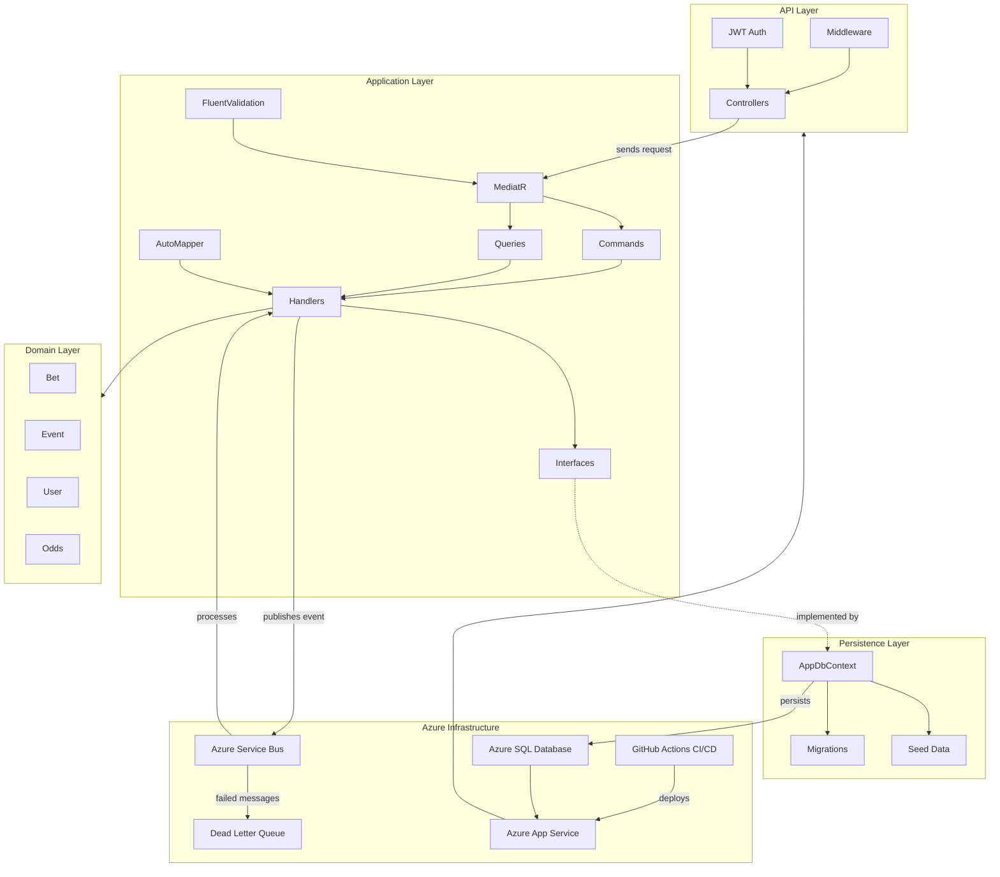
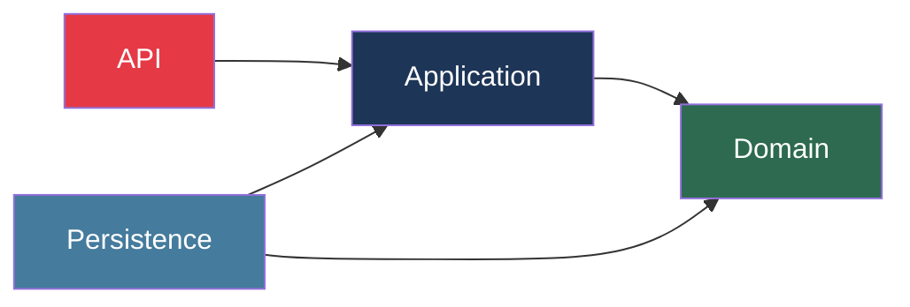
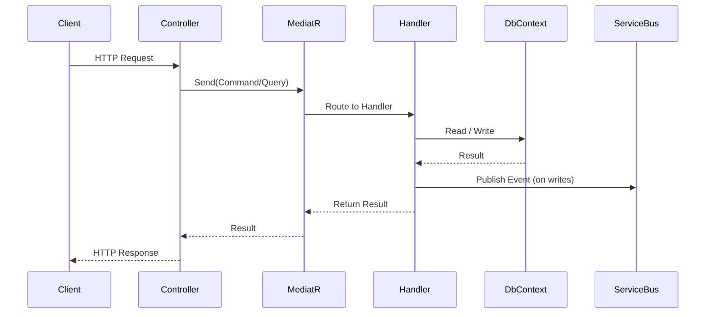

# BetEngineApi

A production-style betting engine API built with ASP.NET Core, Clean Architecture, CQRS with MediatR, and Entity Framework Core — featuring event-driven messaging via Azure Service Bus and deployed to Azure App Service with GitHub Actions CI/CD.

---

## Tech Stack

- **Backend:** ASP.NET Core (.NET 10), C#
- **Architecture:** Clean Architecture, CQRS with MediatR
- **Database:** Entity Framework Core, SQL Server
- **Messaging:** Azure Service Bus
- **Cloud:** Azure App Service
- **CI/CD:** GitHub Actions
- **Auth:** ASP.NET Core Identity, JWT

---

## Architecture

### Layer Structure



### Dependency Flow



### CQRS Request Flow



---

## Project Structure

```
BetEngineApi/
├── API/
│   ├── Controllers/        # Thin controllers — dispatch only
│   ├── Middleware/         # Global exception handling
│   └── Program.cs          # App startup, DI config
│
├── Application/
│   ├── Bets/
│   │   ├── Queries/
│   │   │   ├── GetBets.cs      # Query — GET all bets
│   │   │   └── GetBetById.cs   # Query — GET by ID
│   │   └── Commands/
│   │       ├── CreateBet.cs    # Command — POST
│   │       ├── EditBet.cs      # Command — PUT
│   │       └── DeleteBet.cs    # Command — DELETE
│   ├── Core/
│      └── MappingProfiles.cs
│
├── Domain/
│   ├── Bets.cs
│
└── Persistence/
    ├── BetEngineDbContext.cs
    ├── DbInitializer.cs
    └── Migrations/
```

---

## Progress

### Phase 1 — Project Setup
- [x] Solution scaffolded with Clean Architecture (API, Application, Domain, Persistence)
- [x] Project references wired correctly (no circular dependencies)
- [x] Git repository initialised with `.gitignore`
- [x] Solution builds cleanly

### Phase 2 — Domain & Database
- [x] Domain entities created (`Bet`, `Event`, `User`, `Odds`)
- [x] `AppDbContext` configured in Persistence layer
- [x] Initial EF Core migration created
- [x] Database seeded with test data

### Phase 3 — CRUD with CQRS + MediatR
- [x] MediatR installed and configured
- [x] `List` query — GET all bets
- [ ] `Details` query — GET bet by ID
- [ ] `Create` command — POST new bet
- [ ] `Edit` command — PUT update bet
- [ ] `Delete` command — DELETE bet
- [ ] All endpoints tested in Postman

### Phase 4 — Error Handling & Validation
- [ ] Global exception middleware configured
- [ ] FluentValidation installed and wired up
- [ ] Validation pipeline behaviour added to MediatR
- [ ] API returns consistent error responses

### Phase 5 — AutoMapper
- [ ] AutoMapper installed and configured
- [ ] DTOs created for all entities
- [ ] Mapping profiles defined
- [ ] Endpoints return DTOs instead of raw entities

### Phase 6 — Authentication
- [ ] ASP.NET Core Identity configured
- [ ] JWT token generation implemented
- [ ] Register and Login endpoints created
- [ ] Protected routes secured with `[Authorize]`

### Phase 7 — Azure Service Bus
- [ ] Azure Service Bus namespace created
- [ ] Queue/topic configured for bet placement events
- [ ] Message publisher implemented in Application layer
- [ ] Message consumer implemented
- [ ] Dead letter queue (DLQ) handling added
- [ ] End-to-end event flow tested locally

### Phase 8 — Deployment
- [ ] Azure App Service provisioned
- [ ] Azure SQL Database provisioned
- [ ] Connection strings configured via Azure App Settings
- [ ] App deployed manually first (confirmed working)
- [ ] GitHub Actions CI/CD pipeline configured
- [ ] Push to main triggers automatic deployment

### Phase 9 — Polish
- [ ] README updated with architecture diagram
- [ ] API documented (Swagger/OpenAPI)
- [ ] Environment variables documented
- [ ] All endpoints re-tested on production URL
- [ ] Added to portfolio at portfolio-saugat.vercel.app

---

## Getting Started

```bash
# Clone the repo
git clone https://github.com/saugat-15/BetEngineApi

# Restore dependencies
dotnet restore

# Apply migrations
dotnet ef database update --project Persistence --startup-project API

# Run the API
cd API && dotnet run
```

---

## Environment Variables

| Variable | Description |
|---|---|
| `ConnectionStrings__Default` | SQL Server connection string |
| `TokenKey` | JWT signing secret |
| `ServiceBus__ConnectionString` | Azure Service Bus connection string |
| `ServiceBus__QueueName` | Queue name for bet events |

---

## Author

**Saugat Giri** — [portfolio-saugat.vercel.app](https://portfolio-saugat.vercel.app) | [GitHub](https://github.com/saugat-15)
